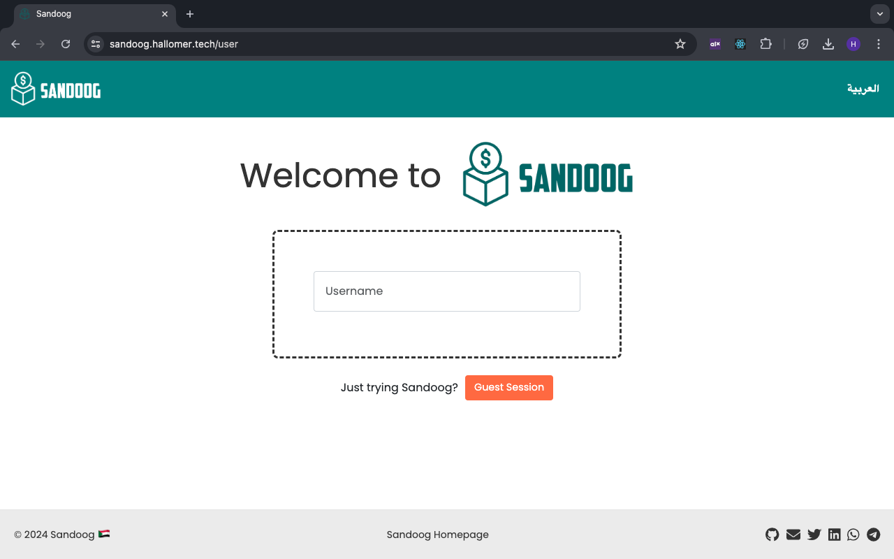
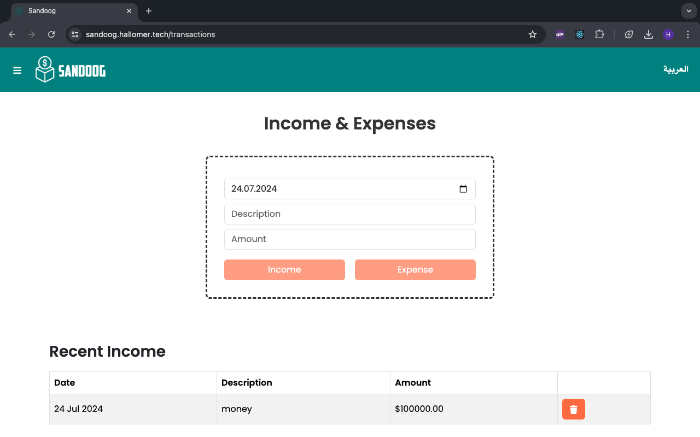
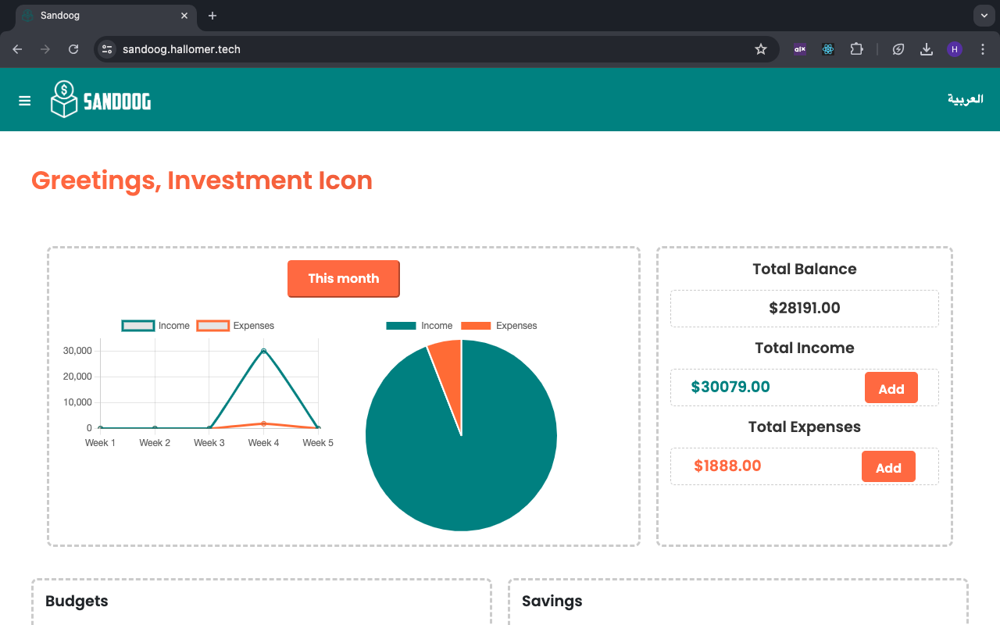
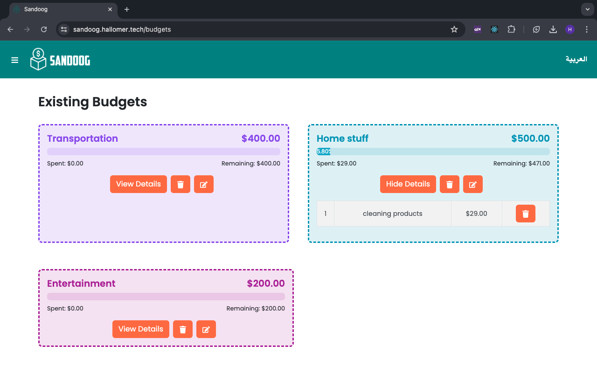

# Sandoog


**Sandoog** is a comprehensive personal finance tracker designed to streamline the way you manage your finances. With features such as income and expense tracking, budget management, and bilingual support, Sandoog aims to bring order to your financial chaos.

**Landing Page**: [Sandoog Landing Page](https://hallomer.github.io/sandoog-landing/)
**Deployed Website**: [Sandoog](https://sandoog.hallomer.tech/)  


## Author 
Hiba Eltayeb, Full Stack Developer 🇸🇩
- **LinkedIn**: [Hiba Eltayeb](https://www.linkedin.com/in/hibaeltayeb/)
- **Twitter**: [Hibathepro](https://twitter.com/Hibathepro)

## Key Features

- **User Authentication**: Secure long sessions with access tokens and refresh tokens, plus a 15-minute guest session.
- **Income & Expenses Tracking**: Log and monitor all your financial transactions.
- **Budget & Savings Management**: Set and track your budgets and savings goals.
- **Summary & Graphs**: Visual summaries to quickly understand your financial status.
- **Bilingual Support**: Available in both English and Arabic.
- **Responsive Design**: Mobile-friendly and responsive interface for seamless use on any device.

## Technologies Used

- **Languages**: JavaScript, Python
- **Frontend**: React, Bootstrap
- **Backend**: Flask
- **Database**: MySQL
- **Libraries**: SQLAlchemy (ORM)
- **Version Control**: Git and GitHub
- **Deployment**: Nginx on a school-provided server
- **Other Tools**: Visual Studio Code, YouTube, Google, LLMs

## Installation

To run Sandoog on your local machine, follow these steps:

### Prerequisites

- Node.js and npm installed
- Python and pip installed
- Flask installed

### Frontend

1. Navigate to the `frontend` directory:
   ```bash
   cd frontend
   ```
2. Install the necessary dependencies:
   ```bash
   npm install
   ```
3. Run the development server:
   ```bash
   npm start
   ```
4. Set up the environment variables by creating a `.env` file in the frontend directory and adding the following variable:

   ```env
   REACT_APP_API_BASE_URL=<Your API Base URL>
   ```

   Replace `<Your API Base URL>` with the actual base URL of your API.

5. Start the development server:

   ```bash
   npm start
   ```

   The server will run on `http://localhost:3000` by default.


### Backend

1. Navigate to the `backend` directory:
   ```bash
   cd backend
   ```
2. Create and activate a virtual environment (optional but recommended):

   ```bash
   python3 -m venv env
   source env/bin/activate
   ```

3. Install the required dependencies:

   ```bash
   pip install -r requirements.txt
   ```

4. Set up the environment variables by creating a `.env` file in the backend directory and adding the following variables:

   ```env
   SAND00G_MYSQL_USER=<YOUR_MYSQL_USERNAME>
   SAND00G_MYSQL_PWD=<YOUR_MYSQL_PASSWORD>
   SAND00G_MYSQL_HOST=<YOUR_MYSQL_HOST>
   SAND00G_MYSQL_DB=<YOUR_MYSQL_DATABASE>
   JWT_SECRET_KEY=<YOUR_JWT_SECRET_KEY>
   ```

   Replace the placeholders with your actual values.

5. Start the backend server:

   ```bash
   python3 -m api.app
   ```

   The server will run on `http://localhost:5000` by default.

## Usage

Once both the frontend and backend servers are running, you can access Sandoog through your web browser at `http://localhost:3000`. The user-friendly interface allows you to quickly log and track your income, expenses, budgets, and savings goals.

## Screenshots



## Links

- **Landing Page Repository**: [GitHub Repository](https://github.com/hallomer/sandoog-landing)
- **Blog Post**: [Introducing Sandoog — A Personal Finance Tracker to Bring Order to Chaos](https://hallomer.medium.com/introducing-sandoog-a-personal-finance-tracker-to-bring-order-to-chaos-2231d50279fe)

## Contributing

Contributions are welcome! If you encounter any issues or have suggestions for improvements, please open an issue or submit a pull request.

## License
This project is licensed under the [MIT License](LICENSE).